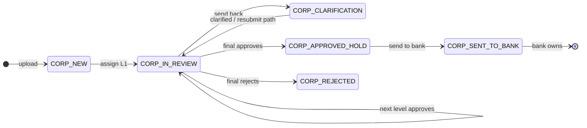
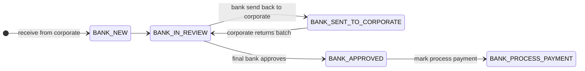

# PayProSys — Workflow & roles (POC scope)

**Status:** agreed for **proof-of-concept** demo (not production architecture). Goal: working app for stakeholder demo and short-lived **EC2** deploy. Prefer **minimum** schema and code; hard-coded defaults acceptable where noted.

**Related:** high-level backlog in [`../FUTURE_FEATURES.md`](../FUTURE_FEATURES.md).

---

## 1. Decisions (locked from Q&A)

| Topic | Decision |
|--------|-----------|
| **Who configures** | **Corporate Admin** defines corporate **roles (L1…Ln display names)** and **linear workflow** for their corporate. **Bank Admin** does the same for their bank. **Super Admin** configures **neither**. |
| **Role model (POC)** | Fixed step slots **L1, L2, … Ln** with **admin-editable display labels** per tenant (simpler than arbitrary dynamic roles). |
| **Upload** | **Any** corporate user may upload a batch. Every new batch enters **L1 review** first. Later product may restrict upload to a role; **out of POC**. |
| **Who sees a new batch** | See **§1a Batch visibility (POC)** — richer rule vs strict “L1 only” variant. |
| **“NA” skip** | **Removed** for POC. |
| **Final corporate actions** | **Approve** (internal: batch is approved but **not** yet visible to bank — e.g. month-end hold) vs **Send to bank** (optional **remarks** with this action only; **those remarks** are what bank may see — **no** other internal corporate thread visible to bank). |
| **Reject vs send back** | **Reject** (corporate final) = **terminal** for that batch on corporate side (no bank). **Send back** = clarification path (see §4). |
| **Bank → corporate send back** | Goes to **last corporate approver level that had approved** (e.g. L3), or **last level** in chain; batch in **Clarification**. Same corporate flow resumes from there. |
| **Bank visibility of remarks** | **Only** remarks attached to corporate **Send to bank** (by final corporate step). All other corporate comments are **internal**. |
| **Parallel approvers** | **None** — strictly **linear** one step at a time. |
| **Same user in multiple roles** | **Allowed** for POC. Behaviour: workflow still advances **step-by-step**; same user may see **consecutive** inbox actions (act twice in a row). No special merge logic required for v0. |
| **Batch file edits** | **Out of POC.** Clarification / review is **remarks only**; re-upload or row edits = **later** planning. |
| **Bank “Process payment”** | **Status only** — marks batch **complete**; **view-only** for everyone; **no** payment integration in POC. |
| **Engineering bar** | POC: minimal tables, pragmatic auth checks, hard-coded limits (e.g. max steps) acceptable. **EC2 demo:** use HTTPS, env-based secrets, don’t ship demo passwords as production. |

### 1a. Batch visibility (POC)

You proposed two ideas:

1. **Richer rule** — Uploader always **view**; **action** only at **current step** (starts at L1); **not visible** to levels **above** the current step (e.g. L2 uploaded → L1 inbox actionable, L2 view-only, L3 doesn’t see it yet); anyone who **already reviewed** (or had it for review) can see it again per your rules.
2. **Ultra-simple** — “New batch only visible to **L1**” (interpreted strictly: only L1 sees it **anywhere**).

**Recommendation for the working POC / EC2 demo:** use **(1) with one constraint**:

- **Inbox (action required):** only users who hold the **current step role** (first = **L1**).
- **View-only:** always allow the **uploader** to open their batch (status trail), even if they have **no** review role or are L2/L3 waiting.
- **Do not** list the batch for **higher** steps than current (L3 doesn’t see it until the workflow advances — matches your L2 / L3 example).
- **Past reviewers:** **view** access for anyone who has **already acted** on that batch (lightweight query on a small `batch_step_action` / remarks table, or “actor user ids” list — POC can be minimal).

**Why not strict (2)?** If literally **only L1** can see a brand-new batch in **any** screen, a random uploader has **no** place in the app to see “it was received” except a toast — awkward in a live client demo. If you still want (2), add at least a **“Upload succeeded — batch #…”** confirmation with a **deep link** that only works for L1 (or break the rule for uploader read-only as above).

---

## 2. Corporate lifecycle (states)

**Names (suggested enums for implementation):**

1. `CORP_NEW` — Uploaded; waiting **L1** (first reviewer in chain).
2. `CORP_IN_REVIEW` — Sitting with **current step** Li (i ≥ 1).
3. `CORP_CLARIFICATION` — Sent back (corporate or bank); waiting action at **return level** (per Q7).
4. `CORP_APPROVED_HOLD` — **Final** corporate reviewer **approved** but has **not** sent to bank yet (month-end / holiday hold).
5. `CORP_REJECTED` — **Terminal** (corporate final reject).
6. `CORP_SENT_TO_BANK` — Handed to bank; corporate side **read-only** except history/inbox visibility rules you already described.

**Typical happy path:**  
`CORP_NEW` → `CORP_IN_REVIEW` (L1 → L2 → …) → `CORP_APPROVED_HOLD` → (optional wait) → `CORP_SENT_TO_BANK`.

**Send back (within corporate):**  
Only from **reviewer** UI when the batch is at **your** step (never from an “uploader-only” screen). **Target:** always **previous step**; at **L1** that means the batch returns to **L1** again (see **§6**).

**Uploader vs send back:**  
Upload is not a review step. **Send back** is never offered on a “my upload” view; if the uploader is also **L1** and the batch is at L1, they act **as L1**, not “as uploader.”

---

## 3. Bank lifecycle (after corporate send)

**Suggested enums:**

1. `BANK_NEW` — Just received from corporate.
2. `BANK_IN_REVIEW` — With bank Li.
3. `BANK_SENT_TO_CORPORATE` — Bank L1 (or policy step) sent back; corporate in clarification / return path.
4. `BANK_CLARIFICATION` — Optional distinct state if you need it vs re-use corporate clarification only on corporate record; **POC simplification:** single **“with bank”** flag + `BANK_IN_REVIEW` / mirror corporate `CORP_CLARIFICATION` when ball is on corporate side — **implementer’s choice** to minimise tables.
5. `BANK_APPROVED` — Bank chain complete, not yet “process payment”.
6. `BANK_PROCESS_PAYMENT` — **Terminal** operational complete (view-only).

*(When the ball is on the corporate side after a bank send-back, corporate batch state uses **Clarification** / return level per §1; bank row may stay in `BANK_SENT_TO_CORPORATE` or mirror **In review** — collapse for POC.)*

---

## 4. Inbox vs History (POC + suggestion)

**Your definitions:**

- **Inbox:** items **not** finished — still need progress (approve, send back, send to bank, etc.) **or** waiting on someone else in an **open** pipeline (optional: show “awaiting L2” for transparency).
- **History:** batches **closed by the bank** — e.g. reached **`BANK_PROCESS_PAYMENT`** or corporate **`CORP_REJECTED`** (both “closed” from a reporting perspective; split tabs if useful).

**Read / “new” / already viewed (suggestion):**

| Approach | Effort | Fit |
|----------|--------|-----|
| **V0 — none** | Lowest | Inbox = query only by **state + current step role**; no unread badge. Fine for first EC2 demo. |
| **V1 — DB read flag** | Low | Table `user_inbox_state(user_id, batch_id, last_seen_at)`; badge “New” if `batch.updated_at > last_seen_at`; mark seen on open. |
| **V2 — notifications** | Higher | Outbox, email, WS — **separate** initiative after POC. |

**Recommendation for POC:** ship **V0** first; add **V1** only if demo feedback asks “what’s new?”.

---

## 5. Implementation phases (unchanged intent, POC-scoped)

| Phase | Deliverable |
|--------|-------------|
| **0** | This doc + enum list in code comments. |
| **1** | DB: corporate/bank **workflow steps** (L1…Ln labels), **user ↔ role** assignment per tenant, batch **status + current_step_index + corporate_remarks_to_bank** (single field for bank-visible text). |
| **2** | APIs: transition actions, inbox list, history list, remarks append (draft/final minimal). |
| **3** | UI: Corporate Admin / Bank Admin **workflow config**, **Inbox**, batch **detail + remark timeline** (internal vs bank-visible clearly separated in UI). |
| **4** | Bank chain + send back to corporate + gating (bank never sees batch until `CORP_SENT_TO_BANK`). |
| **5** | EC2: HTTPS, env config, rotate demo credentials, smoke checklist. |

---

## 6. Locked micro-decisions (agreed)

- **Corporate send-back target (internal):** always **previous step**. At **L1**, “previous” is still **L1** — the batch stays in **L1’s** queue for **clarification / rework** (remarks only in POC; same reviewer level acts again). Not sent to a non-reviewer “uploader” step.
- **`CORP_APPROVED_HOLD`:** **Skippable** for POC. Final corporate reviewer may use a **single** control (e.g. “Approve & send to bank”) for the happy path; optional separate “Approve only” / “Send to bank” later if time allows.

---

*Document owner: product + engineering; revise when POC demo script is written.*
